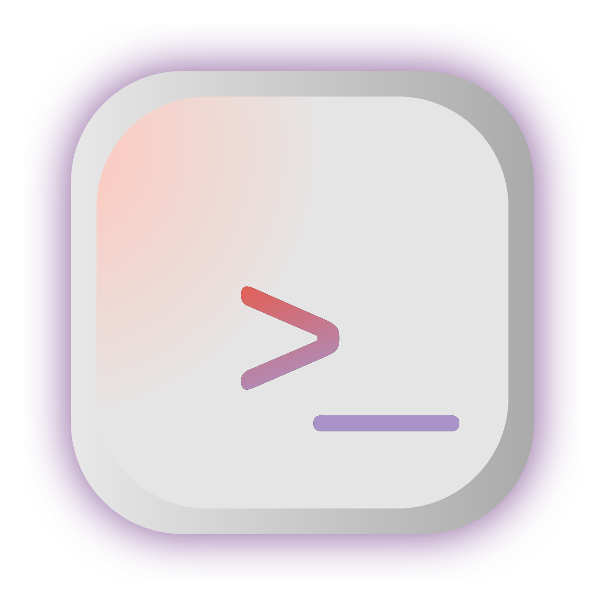
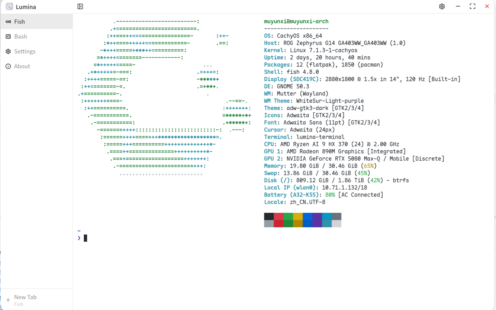
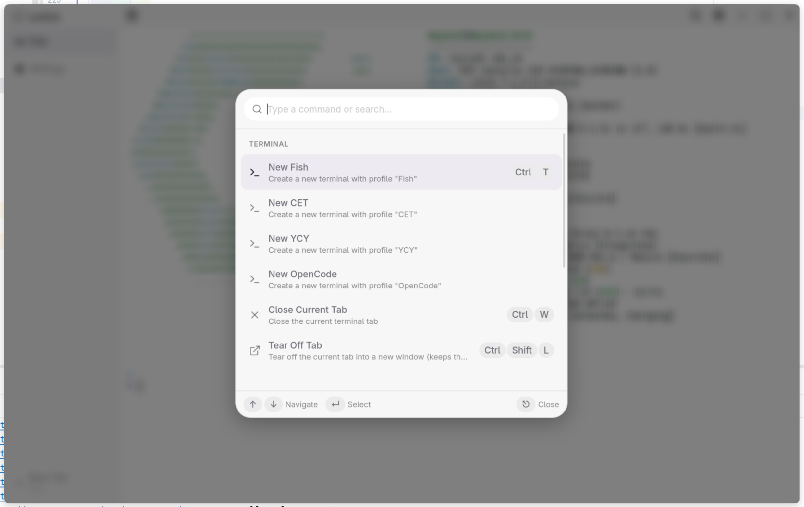
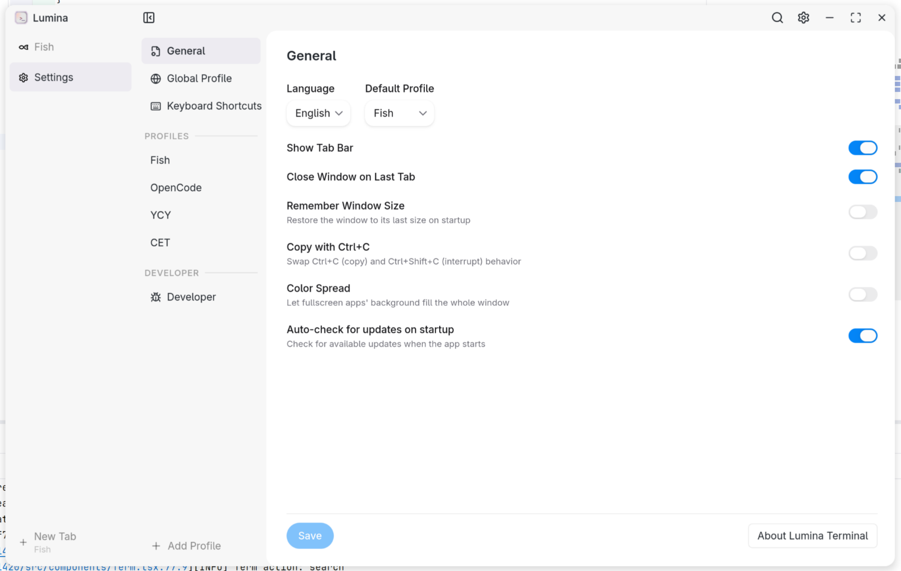
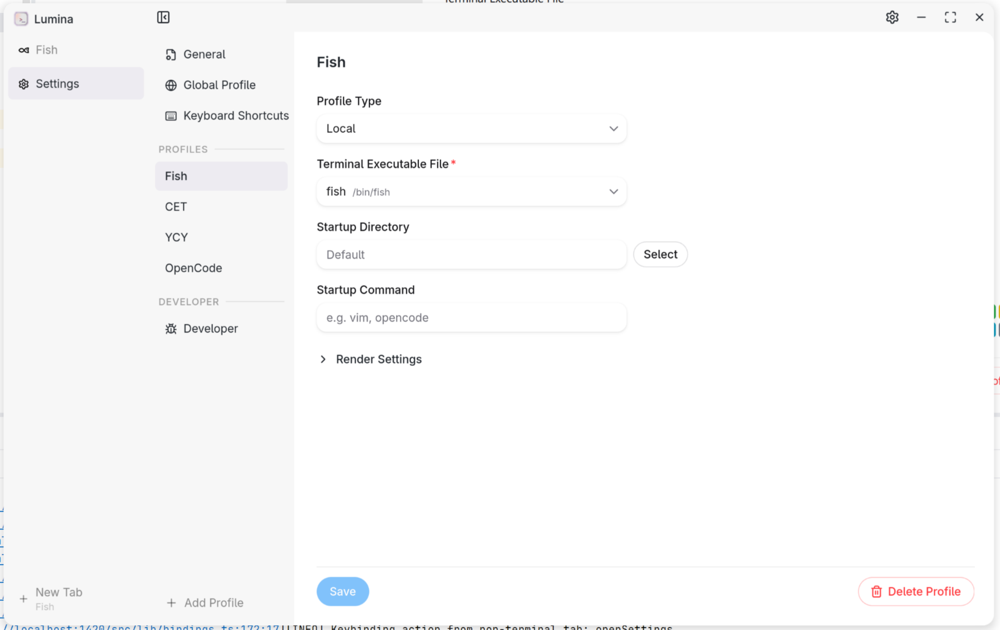

<p align="center">
  <a href="./src/assets/icon.svg">
    
  </a>
  <h3 align="center">Lumina Terminal</h3>
</p>
<p align="center">
  <a href="./README_zh.md">简体中文</a> | English
</p>

A modern, cross-platform terminal emulator built with Tauri, React, and Xterm.js — featuring a sleek UI, command palette, and customizable profiles.

## Installation
* Arch Linux (with an AUR helper like `paru` or `yay`):
```shell
paru -S lumina-terminal-bin
# or: yay -S lumina-terminal-bin
```
* Other Linux / macOS: install with script
```shell
curl -fsSL https://raw.githubusercontent.com/iewnfod/lumina-terminal/master/install.sh | bash
```
* Windows: download installer from [releases](https://github.com/iewnfod/lumina-terminal/releases)

## Screenshots

### Terminal
<p align="center">
  
</p>

### Command Palette
<p align="center">
  
</p>

### Settings
<p align="center">
  
</p>

### Profile
<p align="center">
  
</p>

## Features

### Terminal
* Multi-tab terminal backed by [portable-pty](https://docs.rs/portable-pty/latest/portable_pty/) — each tab runs a real shell process
* **Tear off tabs** — move a tab into its own window (`Ctrl+Shift+L` / `Cmd+Shift+L`) while keeping the running process and scrollback alive
* Configurable shell per profile — use PowerShell, WSL, Git Bash, or any executable
* [WebGL renderer](https://github.com/xtermjs/xterm.js/tree/master/addons/addon-webgl) for GPU-accelerated rendering (optional per-profile)
* [Unicode 11 width rules](https://github.com/xtermjs/xterm.js/tree/master/addons/addon-unicode11) — correct column widths for modern emoji and symbols (xterm ships only Unicode 6 by default)
* Chunked output batching — smoothly handles large text dumps without blocking the UI
* Drag and drop files into the terminal to insert their paths
* Auto-resize terminal dimensions when the window or container changes

### User Interface
* **Command Palette** (`Ctrl+Shift+P` / `Cmd+Shift+P`) — search and execute commands with keyboard navigation
* **Tab Bar** — sidebar with tab list, drag region, and hover-close buttons, toggleable via title bar or command palette
* **Custom Title Bar** — window controls (minimize/maximize/close) integrated with the terminal theme on Windows & Linux
* **Auto Theme** — UI light/dark mode automatically syncs to the terminal background color
* **Color Spread** — a fullscreen TUI app's uniform edge background can fill the whole window chrome for an immersive look (toggleable in settings)

### Keyboard Shortcuts
* Fully customizable keybindings stored in the config file
* Default bindings:
  * `Ctrl/Cmd+T` — New tab
  * `Ctrl/Cmd+W` — Close current tab
  * `Ctrl/Cmd+Shift+L` — Tear off current tab into a new window
  * `Ctrl/Cmd+,` — Open settings
  * `Ctrl/Cmd+Shift+P` — Command palette
  * `Ctrl/Cmd+1–9` — Switch to tab by index
* `Ctrl+C` / `Ctrl+Shift+C` swap (non-macOS) — copy selection with `Ctrl+C`, send SIGINT with `Ctrl+Shift+C`

### Profiles
* Multiple named profiles with per-profile shell, dimensions, fonts, and theme
* Terminal settings per profile:
  * Shell executable path (with file browser)
  * Rows & columns
  * Padding
  * Font family, weight, size, and italic style
  * WebGL renderer toggle
  * Startup command — run a program (e.g. `vim`, `opencode`) instead of dropping into an interactive shell; the tab closes when the command exits (passed to the remote host for SSH profiles)
* Custom terminal themes via JSON files (xterm.js ITheme format) with live color preview

### i18n
* English & Simplified Chinese (简体中文)

### Welcome Wizard
* First-run onboarding with language selection, profile creation, and a confetti finish

## Performance

Lumina Terminal's rendering pipeline is tuned to stay smooth under heavy output — large `cat`, ANSI-dense TUIs, scrolling, and unicode — while keeping memory bounded via read backpressure.

Benchmarks below use [vtebench](https://github.com/alacritty/vtebench) (the same suite Alacritty uses), reporting **90th-percentile** sample latency (lower is better). Lumina is compared against three peers:
- [Alacritty](https://alacritty.org/) — native Rust + OpenGL, the performance ceiling for any terminal
- [Tabby](https://tabby.sh/) — Electron + xterm.js, a popular web-tech terminal
- VS Code integrated terminal — Electron + xterm.js, the most widely used web-tech terminal

| Benchmark | Lumina | Alacritty | Tabby | VS Code |
|-----------|-------:|----------:|------:|--------:|
| cursor_motion | 44ms | 9ms | 89ms | 165ms |
| light_cells | 26ms | 8ms | 60ms | 138ms |
| medium_cells | 65ms | 8ms | 73ms | 320ms |
| dense_cells | 104ms | 25ms | 247ms | 473ms |
| scrolling_fullscreen | 37ms | 10ms | 74ms | 139ms |
| scrolling | 357ms | 158ms | 198ms | 730ms |
| scrolling_top_region | 407ms | 172ms | 191ms | 1296ms |
| scrolling_bottom_region | 417ms | 128ms | 198ms | 1250ms |
| scrolling_top_small_region | 404ms | 138ms | 175ms | 1391ms |
| scrolling_bottom_small_region | 2307ms | 190ms | 181ms | 1364ms |
| sync_medium_cells | 63ms | 9ms | 72ms | 164ms |
| unicode | 45ms | 7ms | 73ms | 56ms |

Lumina trails Alacritty by the expected margin for an xterm.js + webview architecture, but **comfortably outperforms both Tabby and the VS Code integrated terminal** — roughly 1.5-6× faster on most cell/scroll benchmarks — while running the same underlying web rendering stack.

For comparison, a simple `cat` of a 50MB random text file completes in **~4.0s** (Alacritty: ~3.2s):

<p align="center">
  
</p>

## Development
1. Clone the repo and enter it.
```shell
git clone https://github.com/iewnfod/lumina-terminal.git
cd lumina-terminal
```
2. Install dependencies.
```shell
pnpm install
```
3. Run tauri dev.
```shell
pnpm tauri dev
```

## Technology Used
* [Tauri & Tauri Plugins](https://tauri.app/)
* [Rust](https://rust-lang.org/)
* [pnpm](https://pnpm.io/)
* [TypeScript](https://www.typescriptlang.org/)
* [React](https://react.dev/)
* [Vite](https://vite.dev/)
* [HeroUI](https://heroui.com/)
* [portable-pty](https://docs.rs/portable-pty/latest/portable_pty/)
* [log](https://docs.rs/log/latest/log/)
* [Xterm.js & Addons](https://xtermjs.org/)
* [Tailwind CSS](https://tailwindcss.com/)
* [Lucide Icons](https://lucide.dev/)
* [Framer Motion](https://www.framer.com/motion/)
* [react-markdown](https://github.com/remarkjs/react-markdown)

## License
[Mozilla Public License Version 2.0](./LICENSE)
