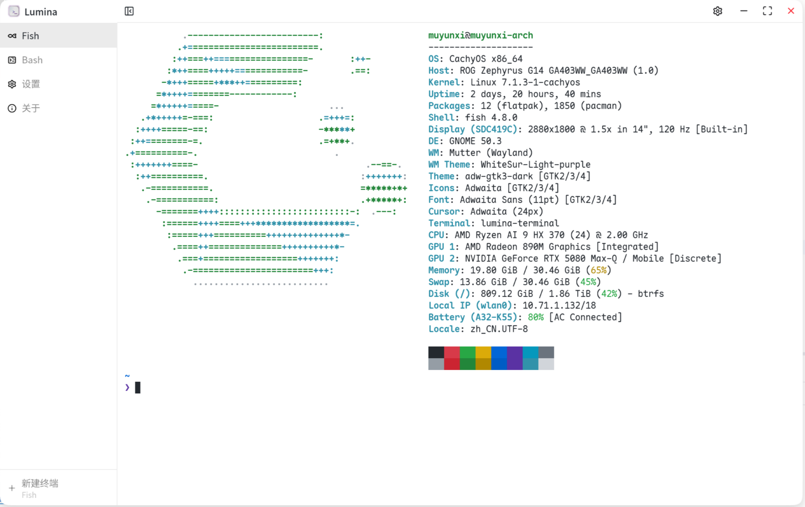
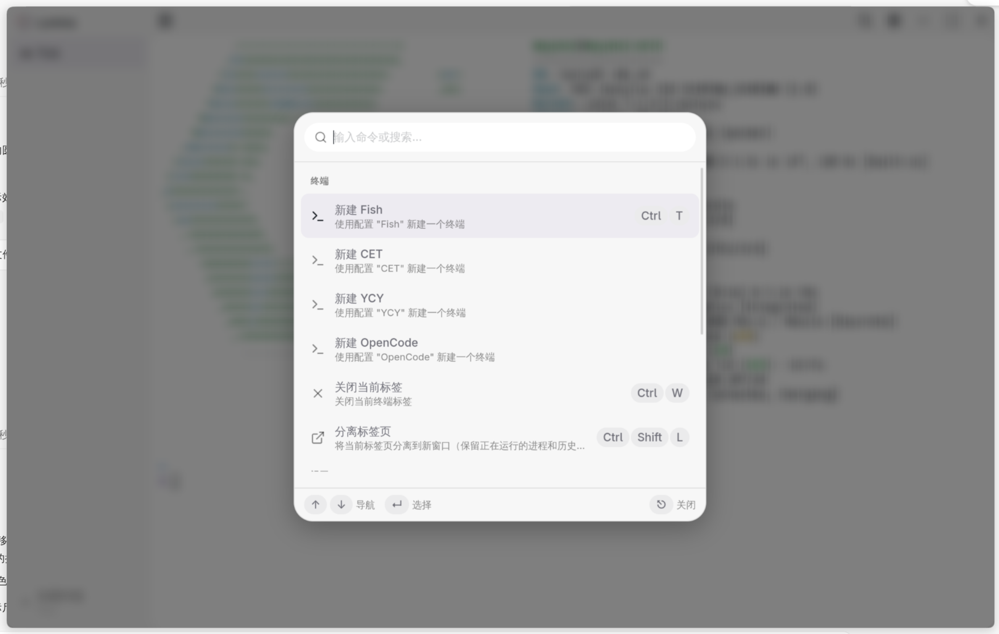
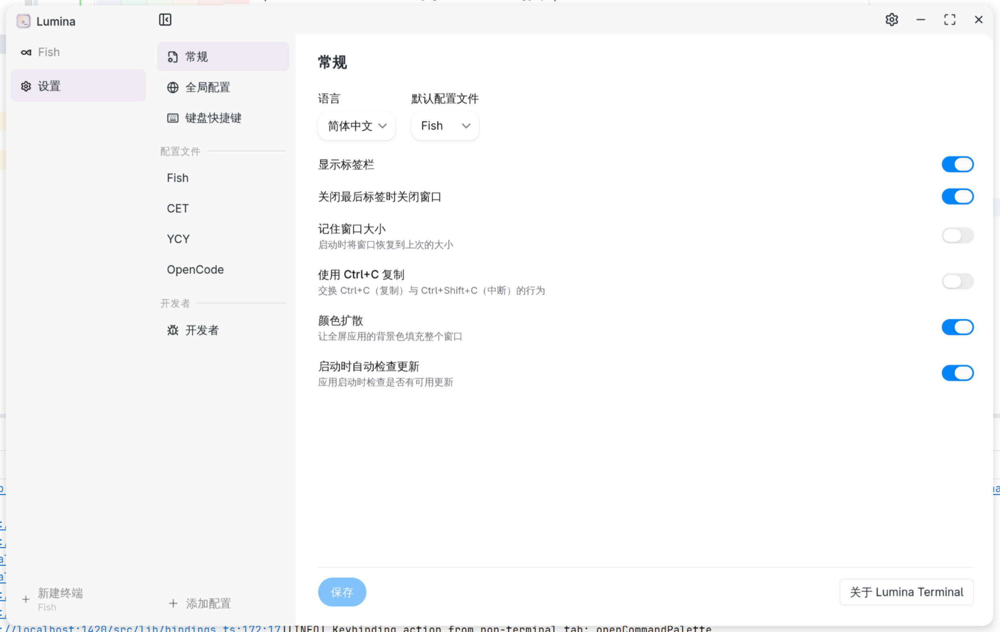
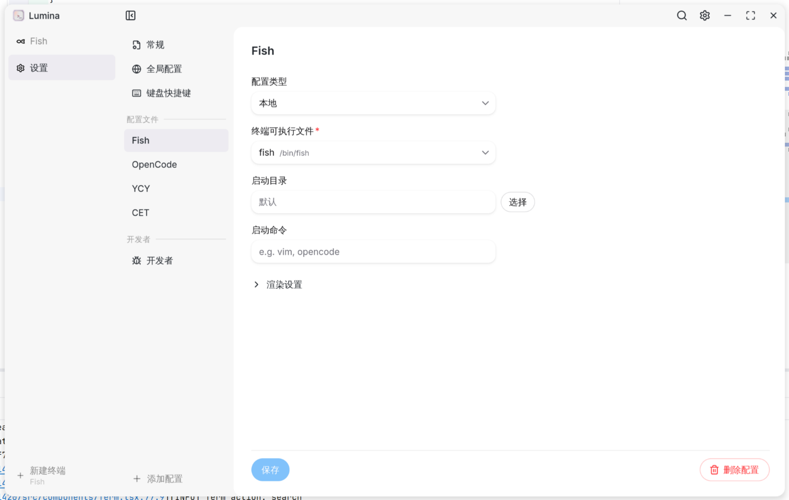

<p align="center">
  <a href="./src/assets/icon.svg">
    
  </a>
  <h3 align="center">Lumina Terminal</h3>
</p>
<p align="center">
  简体中文 | <a href="./README.md">English</a>
</p>

一个基于 Tauri、React 和 Xterm.js 构建的现代跨平台终端模拟器，拥有精美的界面、命令面板和可自定义的配置文件。

## 安装
* Arch Linux（使用 `paru` 或 `yay` 等 AUR 助手）：
```shell
paru -S lumina-terminal-bin
# 或：yay -S lumina-terminal-bin
```
* 其他 Linux / macOS：使用脚本安装
```shell
curl -fsSL https://raw.githubusercontent.com/iewnfod/lumina-terminal/master/install.sh | bash
```
* Windows：从[发布页](https://github.com/iewnfod/lumina-terminal/releases)下载安装包

## 截图

### 终端
<p align="center">
  
</p>

### 命令面板
<p align="center">
  
</p>

### 设置
<p align="center">
  
</p>

### 配置文件
<p align="center">
  
</p>

## 功能特性

### 终端
* 基于 [portable-pty](https://docs.rs/portable-pty/latest/portable_pty/) 的多标签页终端 — 每个标签页运行一个真实的 Shell 进程
* **撕离标签页** — 将标签页移到独立窗口（`Ctrl+Shift+L` / `Cmd+Shift+L`），同时保留运行中的进程和滚动历史
* 每个配置文件可指定不同的 Shell — 支持 PowerShell、WSL、Git Bash 等任意可执行文件
* [WebGL 渲染器](https://github.com/xtermjs/xterm.js/tree/master/addons/addon-webgl) — GPU 加速渲染（每个配置文件可独立开关）
* [Unicode 11 宽度规则](https://github.com/xtermjs/xterm.js/tree/master/addons/addon-unicode11) — 正确计算现代 emoji 和符号的列宽（xterm 默认仅内置 Unicode 6）
* 可选的[字形簇](https://github.com/xtermjs/xterm.js/tree/master/addons/addon-unicode-graphemes)渲染（实验性）— 正确聚类 Unicode 11 仍会拆分的复杂 emoji ZWJ 序列、旗帜和组合字符
* 分块批量输出 — 流畅处理大文本输出，不阻塞 UI
* 拖放文件到终端即可插入文件路径
* 窗口或容器大小变化时自动调整终端尺寸

### 用户界面
* **命令面板** (`Ctrl+Shift+P` / `Cmd+Shift+P`) — 搜索并执行命令，支持键盘导航
* **标签栏** — 侧边栏显示标签列表，支持拖拽区域和悬停关闭按钮，可通过标题栏或命令面板切换显示
* **自定义标题栏** — Windows 和 Linux 上窗口控制按钮与终端主题颜色融为一体
* **自动主题** — UI 明暗模式自动跟随终端背景色
* **颜色扩散** — 全屏 TUI 程序统一的边缘背景可铺满整个窗口边框，沉浸感更强（可在设置中开关）

### 键盘快捷键
* 完全可自定义的快捷键配置，保存在配置文件中
* 默认快捷键：
  * `Ctrl/Cmd+T` — 新建标签页
  * `Ctrl/Cmd+W` — 关闭当前标签页
  * `Ctrl/Cmd+Shift+L` — 将当前标签页撕离到新窗口
  * `Ctrl/Cmd+,` — 打开设置
  * `Ctrl/Cmd+Shift+P` — 命令面板
  * `Ctrl/Cmd+1–9` — 按序号切换标签页
* `Ctrl+C` / `Ctrl+Shift+C` 互换（非 macOS）— `Ctrl+C` 复制选区，`Ctrl+Shift+C` 发送中断信号

### 配置文件
* 多个命名配置文件，各自独立设置 Shell、尺寸、字体和主题
* 每个配置文件可设置：
  * Shell 可执行文件路径（支持文件浏览器选择）
  * 行数与列数
  * 内边距
  * 字体族、粗细、大小和斜体样式
  * WebGL 渲染器开关
  * 启动命令 — 启动时运行指定程序（如 `vim`、`opencode`）而非进入交互式 Shell，命令退出时标签页随之关闭（SSH 配置文件会传给远程主机）
* 自定义终端主题，通过 JSON 文件加载（xterm.js ITheme 格式），支持实时颜色预览

### 国际化
* 英语 & 简体中文

### 欢迎向导
* 首次启动引导流程：语言选择 → 创建配置文件 → 撒花完成

## 性能

Lumina Terminal 的渲染管线针对高负载输出做了调优 —— 大文件 `cat`、ANSI 密集的 TUI、滚动、Unicode —— 同时通过读取背压保持内存占用可控。

以下基准测试使用 [vtebench](https://github.com/alacritty/vtebench)（Alacritty 使用的同一套测试工具），报告 **90 分位**（p90）采样延迟（越低越好）。Lumina 与以下三个同类对比：
- [Alacritty](https://alacritty.org/) — 原生 Rust + OpenGL，任何终端的性能天花板
- [Tabby](https://tabby.sh/) — Electron + xterm.js，流行的 Web 技术终端
- VS Code 内置终端 — Electron + xterm.js，使用最广泛的 Web 技术终端

| 测试 | Lumina | Alacritty | Tabby | VS Code |
|------|-------:|----------:|------:|--------:|
| cursor_motion | 46ms | 9ms | 89ms | 165ms |
| light_cells | 29ms | 8ms | 60ms | 138ms |
| medium_cells | 64ms | 8ms | 73ms | 320ms |
| dense_cells | 116ms | 25ms | 247ms | 473ms |
| scrolling_fullscreen | 70ms | 10ms | 74ms | 139ms |
| scrolling | 357ms | 158ms | 198ms | 730ms |
| scrolling_top_region | 425ms | 172ms | 191ms | 1296ms |
| scrolling_bottom_region | 304ms | 128ms | 198ms | 1250ms |
| scrolling_top_small_region | 400ms | 138ms | 175ms | 1391ms |
| scrolling_bottom_small_region | 309ms | 190ms | 181ms | 1364ms |
| sync_medium_cells | 65ms | 9ms | 72ms | 164ms |
| unicode | 29ms | 7ms | 73ms | 56ms |

作为 xterm.js + webview 架构，Lumina 与 Alacritty 的差距在预期范围内，但**在大多数 cell/scroll 测试中明显优于 Tabby 和 VS Code 内置终端** —— 快约 1.5-6 倍 —— 而它们运行的是同样的底层 Web 渲染技术栈。

## 开发
1. 克隆此仓库并进入目录
```shell
git clone https://github.com/iewnfod/lumina-terminal.git
cd lumina-terminal
```
2. 安装依赖
```shell
pnpm install
```
3. 运行 tauri dev
```shell
pnpm tauri dev
```

## 使用的技术
* [Tauri & Tauri Plugins](https://tauri.app/)
* [Rust](https://rust-lang.org/)
* [pnpm](https://pnpm.io/)
* [TypeScript](https://www.typescriptlang.org/)
* [React](https://zh-hans.react.dev/)
* [Vite](https://cn.vite.dev/)
* [HeroUI](https://heroui.com/)
* [portable-pty](https://docs.rs/portable-pty/latest/portable_pty/)
* [log](https://docs.rs/log/latest/log/)
* [Xterm.js & Addons](https://xtermjs.org/)
* [Tailwind CSS](https://tailwindcss.com/)
* [Lucide Icons](https://lucide.dev/)
* [react-markdown](https://github.com/remarkjs/react-markdown)

## 开源协议
[Mozilla Public License Version 2.0](./LICENSE)
